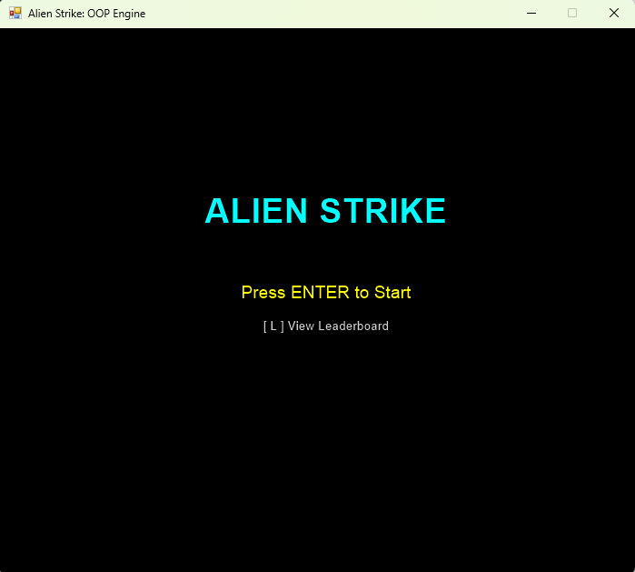
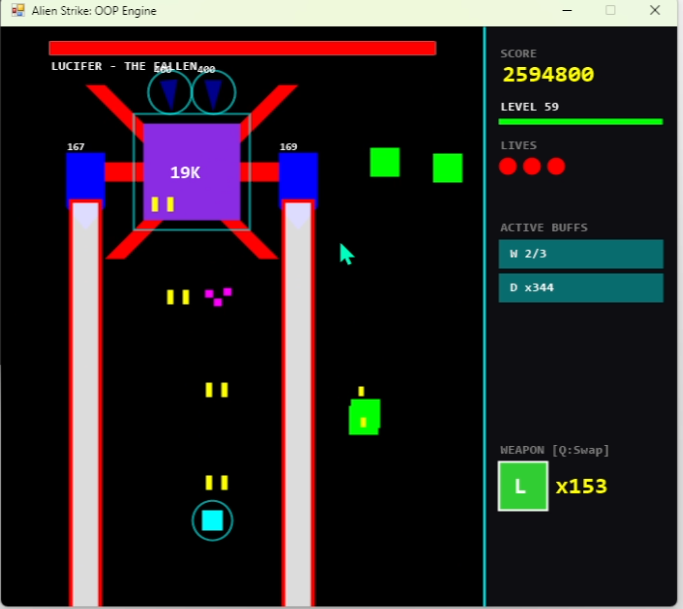
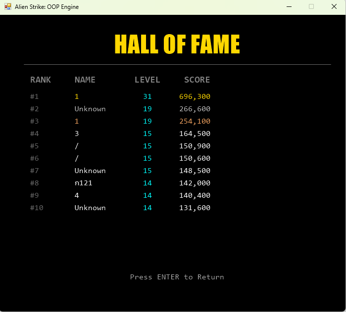
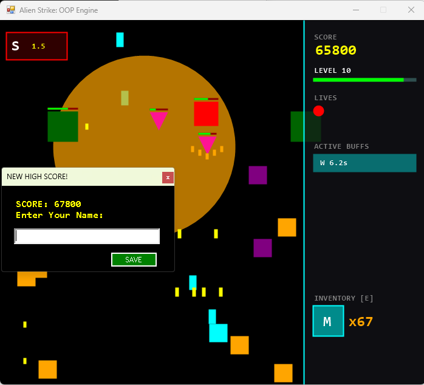
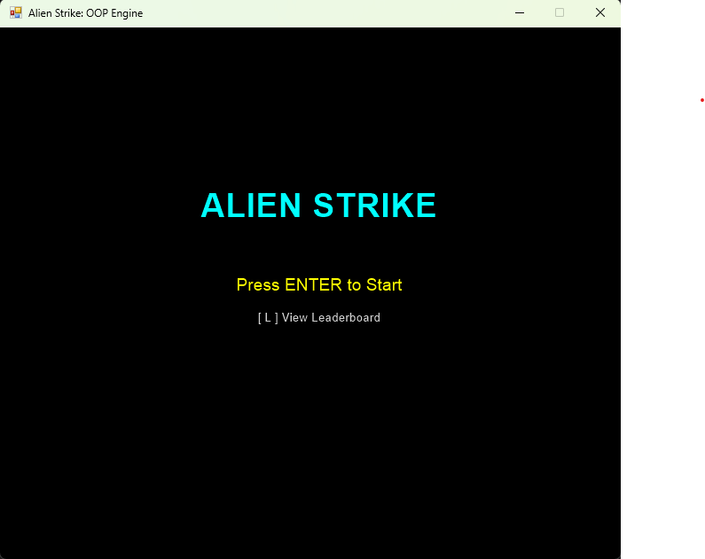
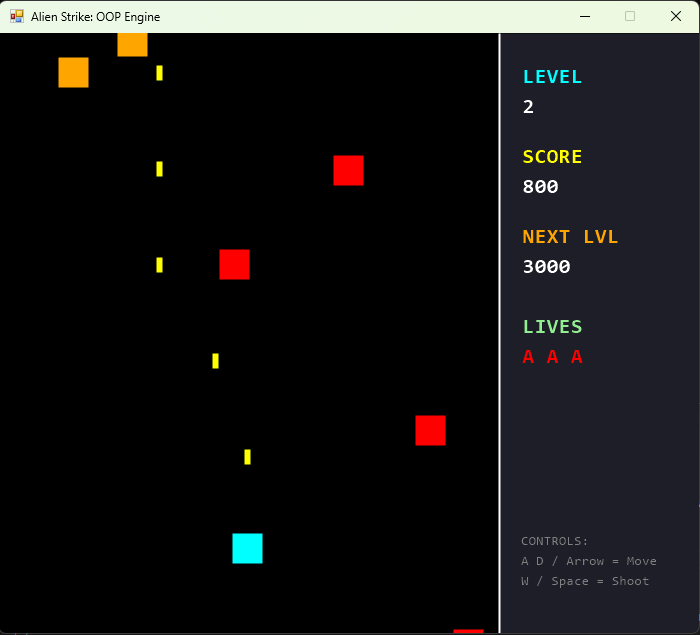
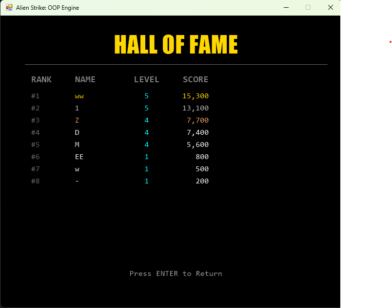
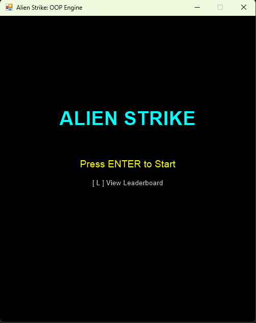
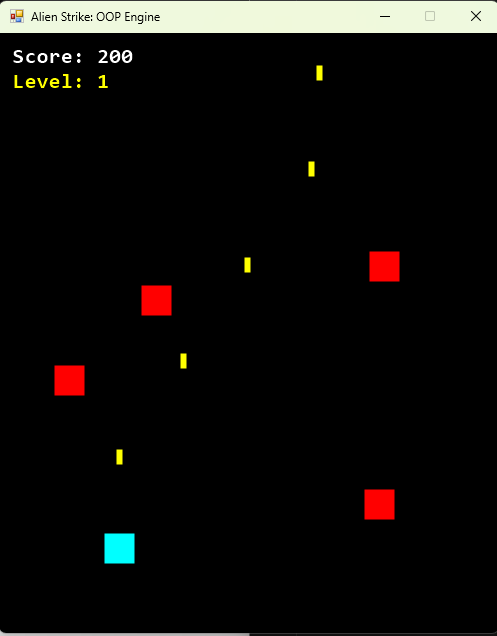
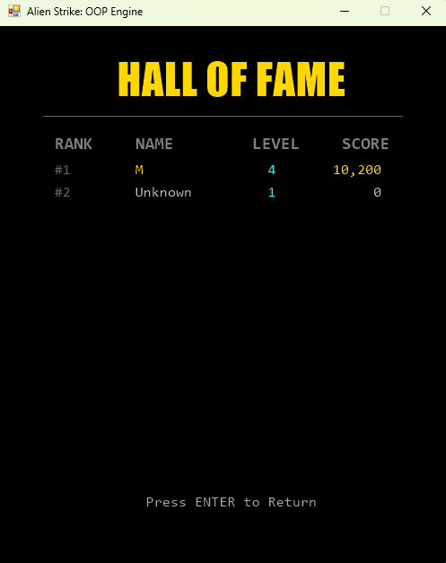

# Alien Strike: PowerShell OOP Engine

A classic vertical space shooter game built entirely using **PowerShell** and **System.Windows.Forms (GDI+)**.

This project demonstrates how Object-Oriented Programming (OOP) principles can be applied in PowerShell scripting to create a functional real-time game loop with collision detection, entity management, and state handling.


<details open>
<summary><b>Version 4.0.0</b></summary>
<br>

| Start Screen | Gameplay | Leaderboard |
|:---:|:---:|:---:|
|  |  |  |

</details>

<details>
<summary><b>Version 3.0.0</b></summary>
<br>

| Start Screen | Gameplay | Leaderboard |
|:---:|:---:|:---:|
|  |  |  |

</details>

<details>
<summary><b>Version 2.0.0</b></summary>
<br>

| Start Screen | Gameplay | Leaderboard |
|:---:|:---:|:---:|
|  |  |  |

</details>

<!-- เวอร์ชันเก่าสุด -->
<details>
<summary><b>Version 1.0.0</b></summary>
<br>

| Start Screen | Gameplay | Leaderboard |
|:---:|:---:|:---:|
|  |  |  |

</details>

## Final Elite Class Technical Table

| Sin Class | Technical Mechanic | Threat Profile |
|---|---|---|
| Lust | Directional Inversion | Movement Disruption |
| Gluttony | Shield Devour | Resource Vampirism |
| Greed | Inventory Erasure | Arsenal Sabotage |
| Sloth | Disruption Pulse | Tactical Lockout |
| Wrath | Scatter Shot | High-Density Fire |
| Envy | Weapon Jam | Offensive Suppression |
| Pride | Hitscan Beam | Precision Strike |
| RealPride | Absolute Annihilation | Fatal Execution / Enrage Timer |
| Lucifer | Sovereign Domination | Destructible Multi-Phase Boss |

| System | Type | Technical Description | HUD |
|------|------|----------------------|------|
| Defense Shield | Defensive Layer | Multi-layer hit negation (Max 400) | [D] |
| Missile | Heavy Weapon | AOE projectile with piercing blast | [M] |
| Laser | Precision Weapon | Continuous Hitscan beam (Tracks Player) | [L] |
| Nuke | Ultimate Weapon | Global Field Wipe (Ignores Boss Armor) | [N] |
| Wrath Buff | Combat Buff | 3-Stack Fire Rate Upgrade (Scatter) | [W] |
| Immortal | Status Effect | 3s Damage Immunity (Post-Resurrection) | [I] |

## ⚠️ Note on Graphics
**Current Version (v3.0.0):** 
The game currently utilizes primitive GDI+ shapes (rectangles/squares) for all game entities. This is a deliberate design choice to focus on the core engine logic, physics, and OOP structure first.

Enhanced sprites, textures, and visual effects are planned for future updates. For now, enjoy the retro "developer art" aesthetic!

## 🎮 Features
*   **OOP Design:** Modular code structure separating `Player`, `Enemy`, `Bullet`, and `GameObject` classes.
*   **Dynamic Level System:**
    *   **Level 1-3:** Increasing enemy speed and spawn rates. Colors change to indicate difficulty (Red -> Orange -> Purple).
    *   **Level 4+:** Enemies (Silver) gain AI capabilities to shoot back at the player and move faster.
*   **Leaderboard System:** Local high scores are saved to a JSON file. Includes a GUI for name entry upon Game Over.
*   **Smooth Rendering:** Double-buffered GDI+ rendering to minimize flickering.

## 🚀 How to Play

### Prerequisites
*   Windows OS
*   PowerShell 5.1 or PowerShell Core (7+)

### Installation
1.  Clone this repository:
    ```bash
    git clone https://github.com/phunyawee/AlienStrike.git
    ```
2.  Navigate to the directory.

### Running the Game
Run the main script via PowerShell:

```powershell
.\AlienStrike.ps1
```

## 🎮 Controls

| Key | Action |
|-----|-------|
| W / Up Arrow / Space | Shoot |
| A / Left Arrow | Move Left |
| D / Right Arrow | Move Right |
| Enter | Start Game / Restart / Return from Leaderboard |
| L | View Leaderboard (from Start Screen) |
| ESC | Pause / Exit Game |

---

## 🛠️ Tech Stack

- **Language:** PowerShell  
- **GUI Library:** Windows Forms (`System.Windows.Forms`)  
- **Graphics:** GDI+ (`System.Drawing`)  
- **Data Storage:** JSON (for High Scores)

---

## 🔮 Future Roadmap

- Replace primitive shapes with sprite images.

- Add sound effects 

- Add particle effects for explosions.

- Implement Boss battles at Level ??

Created by [Phunyawee]