# AlienStrike - Technical Wiki (v3.3.0)

## 😈 Elite Enemy Encyclopedia (The 7 Sins)

Each **Sin-class enemy** introduces a unique disruption mechanic that forces players to adapt their combat style.

---

### 1. Lust — *Directional Inversion*

| Image | Description |
|---|---|
| 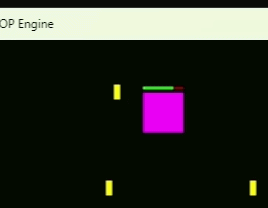 | **Ability:** Fires **Siren Bullets (Pink)**. Upon impact, the player's horizontal controls are inverted **(Left ↔ Right)** for **3 seconds**. |

---

### 2. Gluttony — *Shield Devour*

| Image | Description |
|---|---|
| 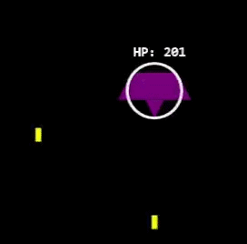 | **Ability:** Fires a massive **Purple Blast**. If hit, it **consumes 50% of the player's Defense Shield** and converts the energy into **HP for the boss**. |

---

### 3. Greed — *Inventory Erasure*

| Image | Description |
|---|---|
| 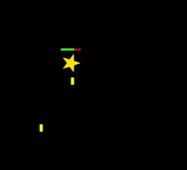 | **Ability:** A fast-moving **gold star entity** that fires a **Gold Arrow**. Impact results in an **instant wipe of the player's entire inventory** *(Missiles, Lasers, Nukes)*. |

---

### 4. Sloth — *Disruption Pulse*

| Image | Description |
|---|---|
| 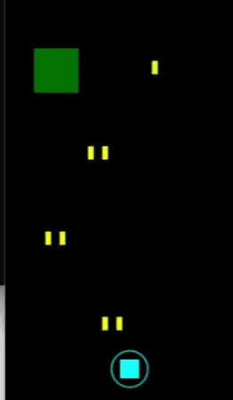 | **Ability:** Drops a **multi-stage bomb** that detonates into a **Shockwave**. Being caught in the pulse triggers the **Jammer effect**, disabling the **[E] item key**. |

---

### 5. Wrath — *Scatter Shot*

| Image | Description |
|---|---|
| 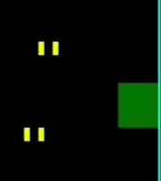 | **Ability:** Aggressive **erratic movement** combined with a **5-way shotgun spread**, designed to overwhelm player positioning. |

---

### 6. Envy — *Weapon Jam*

| Image | Description |
|---|---|
|  | **Ability:** Fires **Silence Bullets (Magenta)**. Triggers the **Silence status**, temporarily disabling the player's **primary fire**. |

---

### 7. Pride — *Hitscan Beam*

| Image | Description |
|---|---|
| 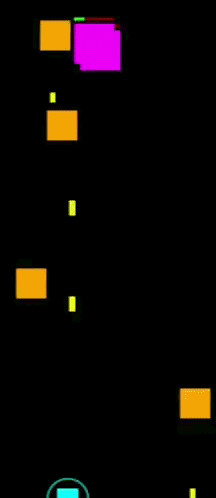 | **Ability:** Charges a powerful **Vertical Laser**. Telegraphed by a **red dotted line**, followed by an **instant-hit beam** and a **high-speed charge attack**. |

---

## 👑 Gatekeeper-Class Entity
### RealPride — *Absolute Annihilation*

| Image | Description |
|---|---|
| 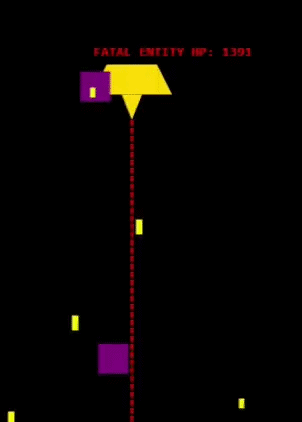 | **Ability:** A Gatekeeper-class entity that appears after defeating **Gluttony three times**. RealPride tracks the player using **smooth pursuit AI** and enforces a **Cataclysm countdown**. If not defeated within **15 laser cycles**, it unleashes **Cataclysm Wave**, a screen-wide fatal attack that results in **instant Game Over**, bypassing shields, lives, and Immortal status. |

---

# 🚀 Player Arsenal & Tactical Systems

## Defensive Layer: **Defense Shield [D]**

| Image | Description |
|---|---|
| 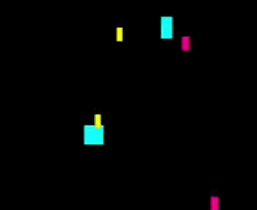 | **System:** A stackable **energy shield** represented by a **Cyan Aura** around the ship. Automatically blocks **damage and debuffs**. **Maximum capacity: 400 hits.** |

---

## Heavy Weaponry: **Missile [M]**

| Image | Description |
|---|---|
| 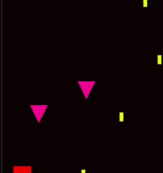 | **Tactical:** A high-damage **AOE projectile**. Upon impact or range expiration, it triggers a **massive explosion** that **pierces multiple enemies**. |

---

## Precision Weaponry: **Laser [L]**

| Image | Description |
|---|---|
| 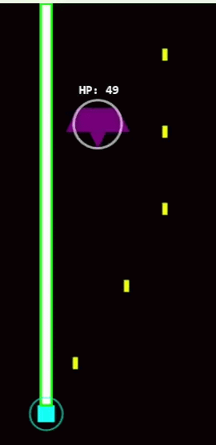 | **Tactical:** A **Lime Hitscan Beam** that tracks the ship's horizontal position. Ideal for **lane clearing** and **high-HP targets** in a **1-second burst**. |

---

## Ultimate Weaponry: **Nuke [N]**

| Image | Description |
|---|---|
| 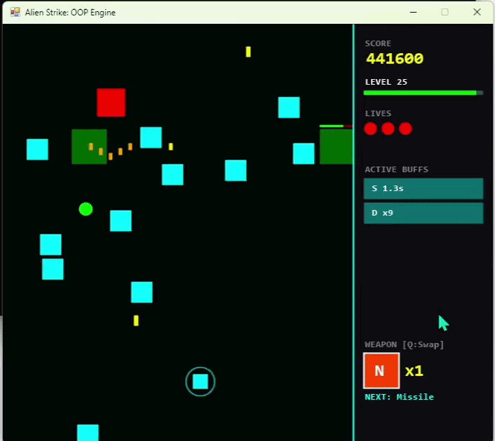 | **Ultimate:** Obtained from **Gluttony**. Clears **all common enemies on screen** and deals **heavy damage to Sin-class bosses**, triggering a **screen-wide wipe effect**. |

---

## Combat Buffs: **Wrath [W] & Speed [S]**

| Image | Description |
|---|---|
| 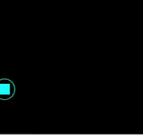 | **Wrath [W]:** Stack **3 kills** to unlock **4-way fire mode**.  **Speed [S]:** Reward from defeating **Sloth**. Grants **200% movement speed for 7 seconds**. |

---

> **"Strategy is the only weapon that can't be jammed."**